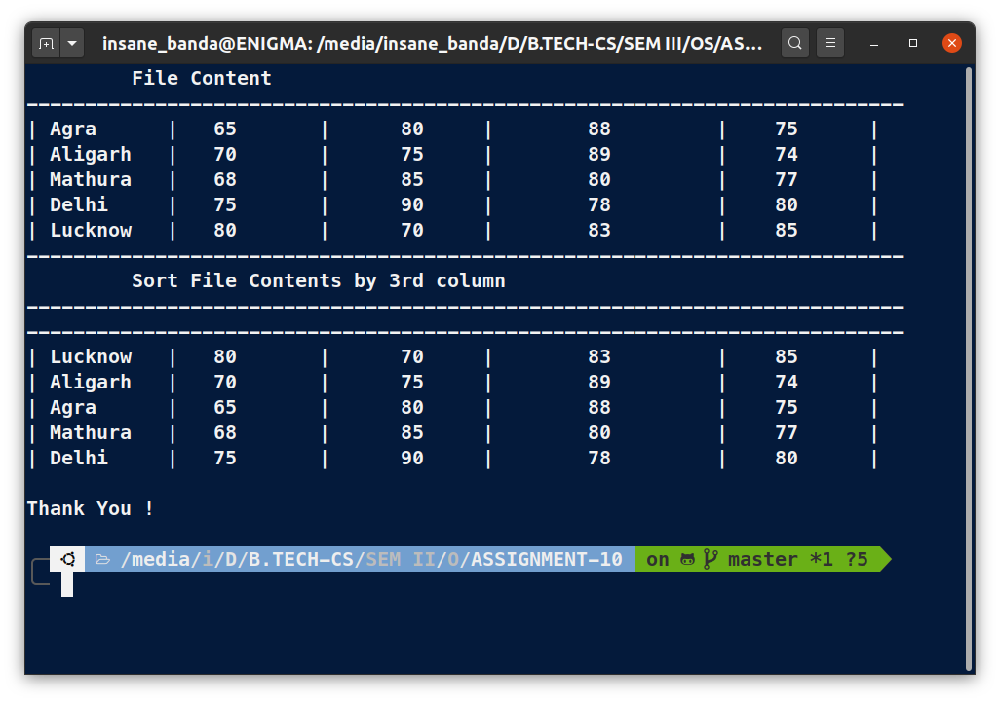

# OS Lab Assignment - 10

------

## **Submitted By -:  Piyush Keshari**
## **Section  -:  C**
## **Roll No. -:  11**
## **Subject  -:  Operating System Lab (BCSC 0803)**
## **Submitted To -:  Ms. Nidhi**

------

### You are given a file of tab-delimited weather data (TSV). There is no header column in this data file. The first five columns of this data are: (a) the name of the city (b) the average monthly temperature in Jan (in Fahrenheit). (c) The average monthly temperature in April (in Fahrenheit). (d) The average monthly temperature in July (in Fahrenheit). (e) the average monthly temperature in October (in Fahrenheit).You need to sort this file on the basis of average monthly temperature in April.

```bash
# !/usr/bin/bash
clear

# Create a Demo.tsv file
cat > Month_Temp.tsv << EOF
---------------------------------------------------------------------------
| Agra      |	65       |      80     |	88         |	75      |
| Aligarh   |	70       |      75     |	89         |	74      |
| Mathura   |	68       |      85     |	80         |	77      |
| Delhi     |	75       |      90     |	78         |	80      |
| Lucknow   |	80       |      70     |	83         |	85      |
---------------------------------------------------------------------------
EOF
# Close Info.tsv file

echo -e "\t File Content "
expand Month_Temp.tsv
echo -e "\t Sort File Contents by 3rd column"
sort -k 6n Month_Temp.tsv
echo
echo "Thank You !"
```


### **OUTPUT:**



------
