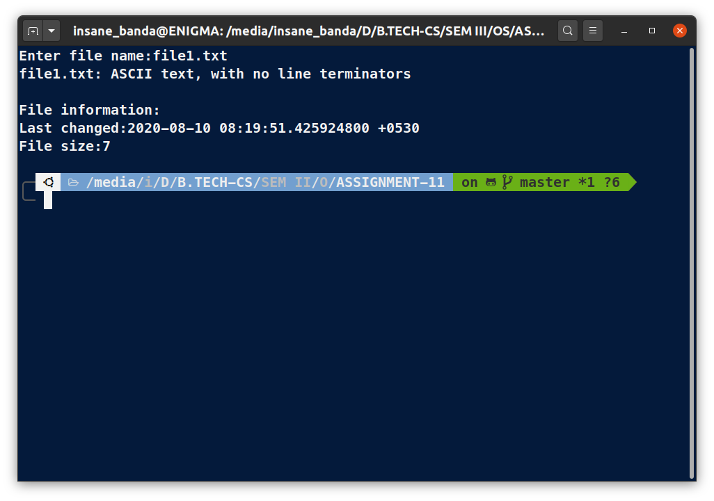

# **OS Lab Assignment - 11**

------

## **Submitted By -:  Piyush Keshari**
## **Section  -:  C**
## **Roll No. -:  11**
## **Subject  -:  Operating System Lab (BCSC 0803)**
## **Submitted To -:  Ms. Nidhi**

------

## <span style="color:crimson">Write a shell script to input a file name and determine whether it is a file or directory and it's file type.</span>

```bash
# !/usr/bin/bash
clear
read -p "Enter file name:" name
result=`file $name`
echo -e "$result"
echo -e "\nFile information:\n$(stat -c "Last changed:%z\nFile size:%s" $name)"
```


### **OUTPUT:**



------
