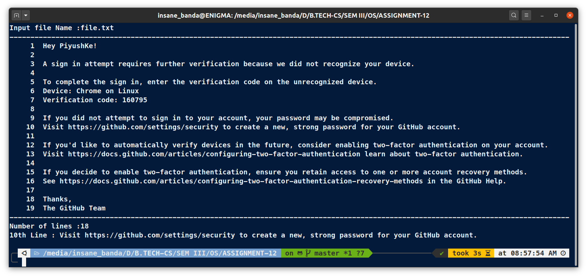

# **OS Lab Assignment - 12**

------

## **Submitted By -:  Piyush Keshari**
## **Section  -:  C**
## **Roll No. -:  11**
## **Subject  -:  Operating System Lab (BCSC 0803)**
## **Submitted To -:  Ms. Nidhi**

------

## <span style="color:crimson">Write the shell script to take file name as input and if the file exists then print the number of lines and also print 10th line of that file.</span>

```bash
# !/usr/bin/bash
clear

# Enter File name for see result
read -p "Input file Name :" File_Name

# To Make sure that the file exist
if [ ! -f $File_Name ]
then
       echo "$File_Name does not exist."
       exit   # If condition is true then exit the script
fi

# use cat command for display file content
echo "------------------------------------------------------------------------------------------------------"
cat -n $File_Name
echo -e "\n----------------------------------------------------------------------------------------------------"
# wc command for display number of line
echo -e "Number of lines :$(wc -l $File_Name | cut -d " " -f 1)"

# use sed command for display 10th line
echo "10th Line : $(sed -n '10p' $File_Name)"

```


### **OUTPUT:**



------
