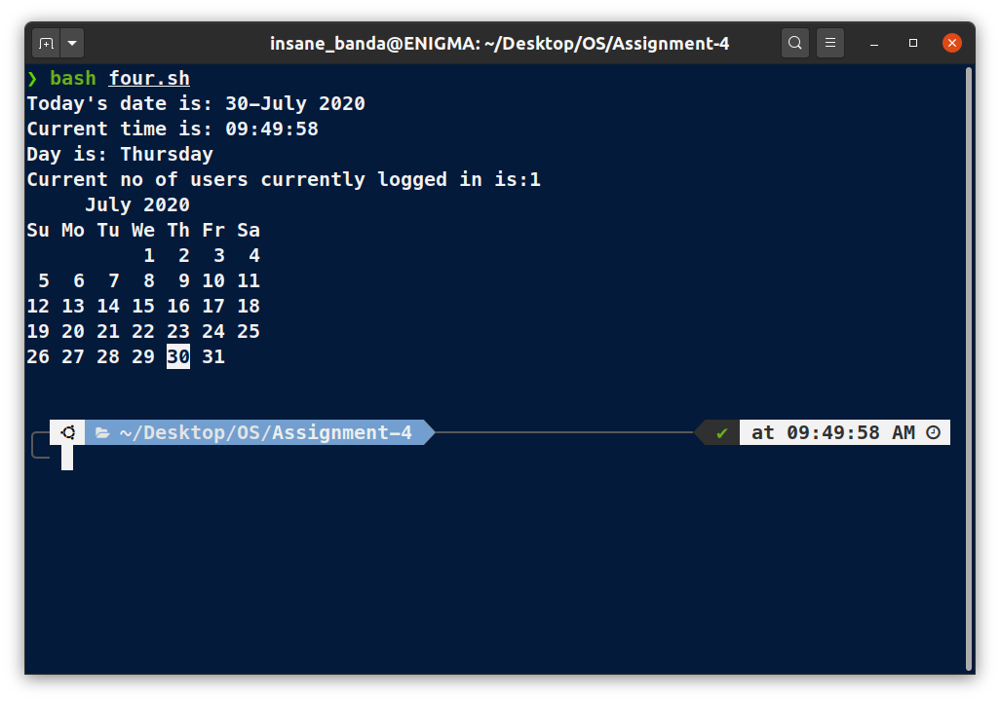

# Piyush Keshari
## sec -> C Roll-No -> 11

# script.sh

```bash
#!/bin/bash
date +"Today's date is: %d-%B %Y
Current time is: %H:%M:%S
Day is: %A"
echo "Current no of users currently logged in is:$(who |wc -l)"
cal
```

# Output

