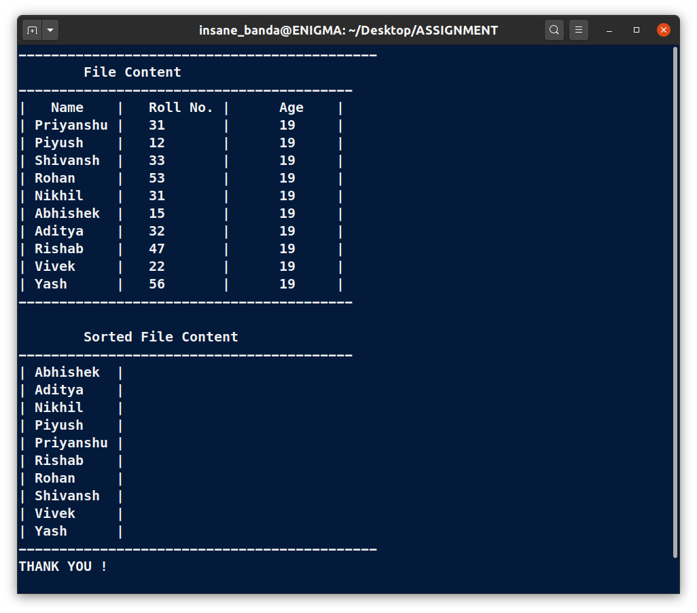

# OS Lab Assignment - 6

------

## **Submitted By -:  PIYUSH KESHARI**
## **Section  -:  C**
## **Roll No. -:  11**
## **Subject  -:  Operating System Lab (BCSC 0803)**
## **Submitted To -:  Ms. Nidhi**
------

## Write a shell script to create a tsv file containing name, roll no. and age of 10    students. Then use that tsv file to display only the names of the students in alphabetical order.

```bash

# !/usr/bin/bash
clear

# Create a Info.tsv file
cat > Info.tsv << EOF
-----------------------------------------
|   Name    |	Roll No. | 	Age    |

| Priyanshu |	31       |	19     |
| Piyush    |	12       |	19     |
| Shivansh  |	33       |	19     |
| Rohan     |	53       |	19     |
| Nikhil    |	31       |	19     |
| Abhishek  |	15       |	19     |
| Aditya    |	32       |	19     |
| Rishab    |	47       |	19     |
| Vivek     |	22       |	19     |
| Yash      |	56       |	19     |
-----------------------------------------
EOF
# Close Info.tsv file

echo "--------------------------------------------"
echo "\tFile Content "

# For see Current file content
expand Info.tsv
echo
echo "\tSorted File Content "

# To see  file content sorted in alphabetical order
sed '1,2d' Info.tsv | cut -d "	" -f 1 | sort
echo "--------------------------------------------"
echo "THANK YOU !"
```

## **OUTPUT:**



------
