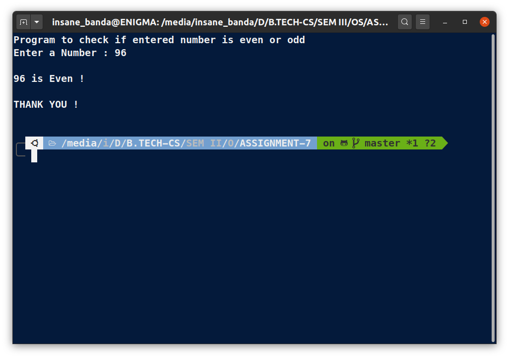

# OS Lab Assignment - 7

------
## **Submitted By -:  PIYUSH KESHARI**
## **Section  -:  C**
## **Roll No. -:  11**
## **Subject  -:  Operating System Lab (BCSC 0803)**
## **Submitted To -:  Ms. Nidhi**
------

### Write a shell script that finds whether an entered number is even or odd.

```bash
# !/usr/bin/bash
clear
echo -e "Program to check if entered number is even or odd"

# For take number from user
read -p "Enter a Number : " number
# Logic for Even no.
rem=$(($number % 2))

# Condition (if else)
if [ $rem -eq 0 ]
then
    echo
    echo "$number is Even !"
else
    echo
    echo "$number is Odd !"
fi
echo -e "\nTHANK YOU !\n"
```

## **OUTPUT:**



------
