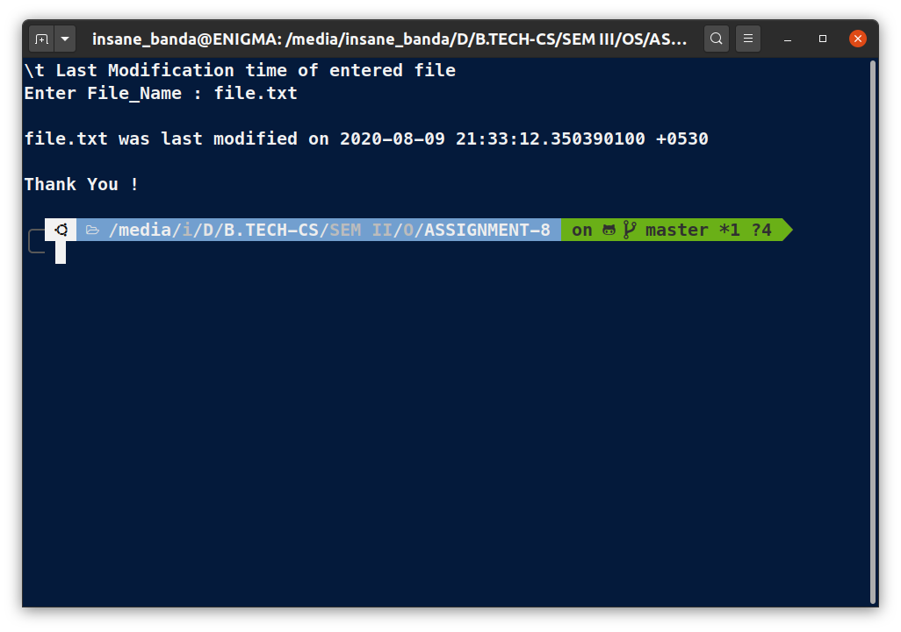

# OS Lab Assignment - 8

------
## **Submitted By -:  PIYUSH KESHARI**
## **Section  -:  C**
## **Roll No. -:  11**
## **Subject  -:  Operating System Lab (BCSC 0803)**
## **Submitted To -:  Ms. Nidhi**
------

### Write a Shell script to accept a filename as argument and displays the last modification time if the file exists and a suitable message if it doesn't.

```bash
# !usr/bin/bash
clear

echo "\t Last Modification time of entered file"

# File_Name for see last modification time
read -p "Enter File_Name : " File_Name
echo

# Make sure Entered File Exist
if [ ! -f $File_Name ]
then
       echo "$File_Name File doesn't Exist. "
       exit 1   # If condition is true then exit the script
fi

# Use stat command to display the result
echo "$File_Name was last modified on $(stat -c %x $File_Name)"
echo
echo "Thank You !"
```

## **OUTPUT:**



------
