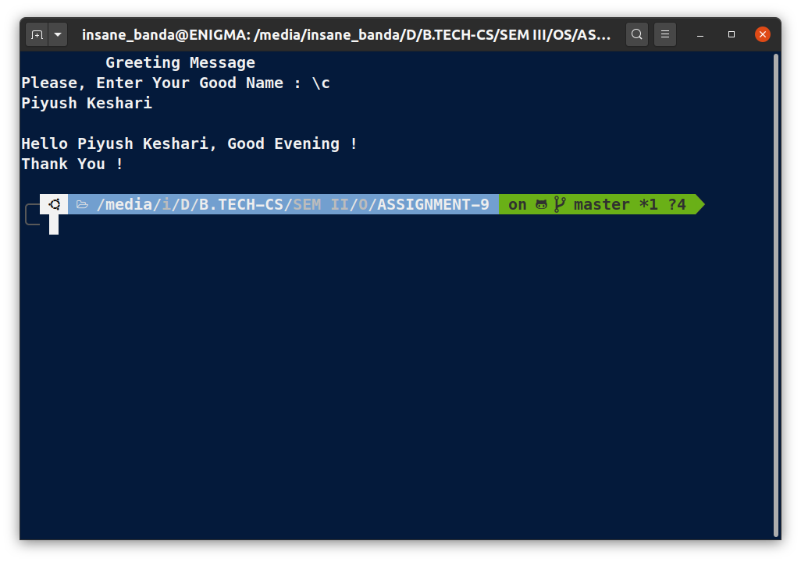

# OS Lab Assignment - 9

------
## **Submitted By -:  PIYUSH KESHARI**
## **Section  -:  C**
## **Roll No. -:  11**
## **Subject  -:  Operating System Lab (BCSC 0803)**
## **Submitted To -:  Ms. Nidhi**
------

###  Write a shell script to take name as a input and display a greeting message to the user by checking system clock.

```bash
# !/usr/bin/bash
clear

echo -e "\t Greeting Message"

echo -e "Please, Enter Your Good Name : \c"
read name
echo

# this for check time
hour=$(date +"%H")

# if else conditions
if [ $hour -lt 12 ]
then echo "Hello $name, Good Morning !"
else if [ $hour -lt 16 ]
then echo "Hello $name, Good Afternoon ! "
else
echo "Hello $name, Good Evening !"
fi
fi
echo "Thank You !"
```

## **OUTPUT:**



------
